<div align="center">

<br/>

# S E R E N E

### *Curating calmness for the mind that never rests.*

*Heal gently, grow deeply & breathe freely*

<br/>

[](https://serene-akshata-s-projects22.vercel.app/)
[](https://serene-r5vl.onrender.com)
[](https://github.com/akshata-gangrade/SERENE)


</div>

---

## 🌙 About SERENE

**SERENE** is a full-stack AI-powered mental wellness platform built to help users manage stress, reflect on their thoughts, and improve emotional well-being. Through a beautifully crafted interface, SERENE brings together three pathways to emotional clarity — an AI companion for real-time support, a mindful journal for personal reflection, and guided breathwork exercises.

> Built with the belief that mental wellness tools should be accessible, private, and genuinely calming to use.

---

## ✨ Features

### 🔐 Authentication & Security
- Secure user registration and login
- JWT-based authentication with protected routes
- Password hashing via Passlib

### 🤖 AI Mental Wellness Chatbot
- Real-time AI-powered conversations powered by Groq
- Emotionally intelligent, context-aware responses
- Chat history management with delete support
- Personalized welcome with quick-start prompts

### 📖 Mindful Journal
- Create, edit, and delete personal journal entries
- Mood tagging (Happy, Sad, Anxious, Grateful, and more)
- Reflective prompts to guide your writing
- Mood history calendar to track your emotional journey over time

### 🌬️ Breathing Sanctuary
- Guided 4-4-4 box breathing sessions
- Animated breathing orb with phase instructions (inhale, hold, exhale)
- Calming full-screen experience designed to ground you

### 👨‍💼 Admin Dashboard
- User activity monitoring
- Platform management capabilities

### 📱 Responsive Design
- Optimized for both desktop and mobile
- Deep teal glassmorphism UI — calming, modern, and intentional

---

## 📸 Screenshots

### Landing Page
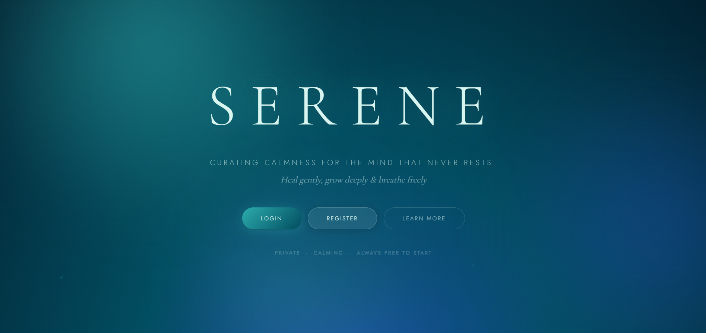

### Registration Page
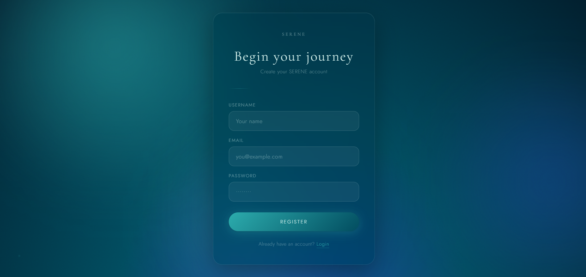

### Login Page
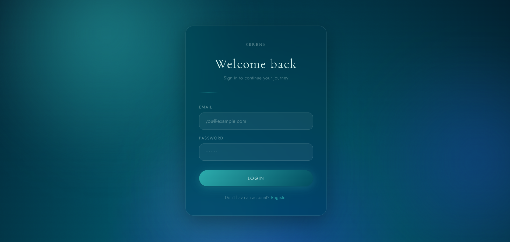

### Dashboard
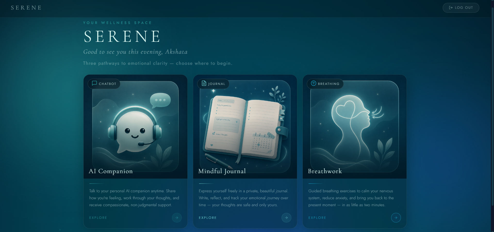

### AI Chatbot
| Welcome | Conversation |
|---|---|
| 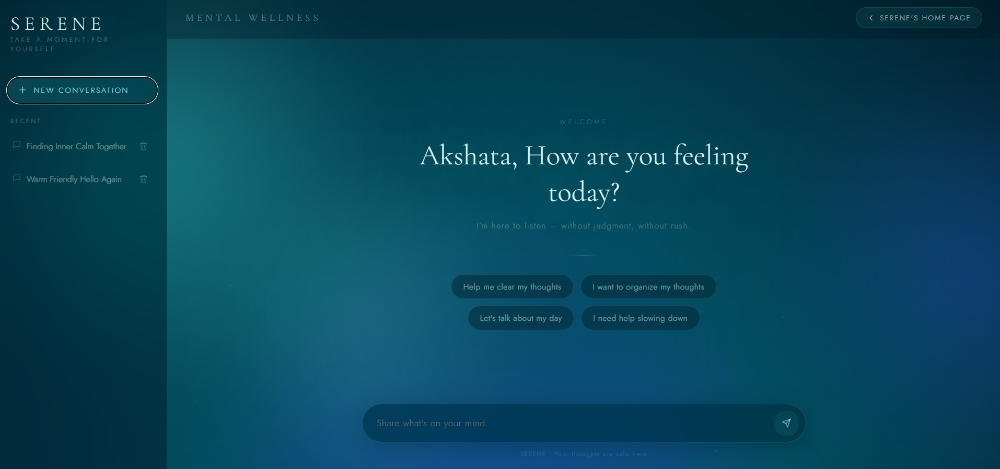 | 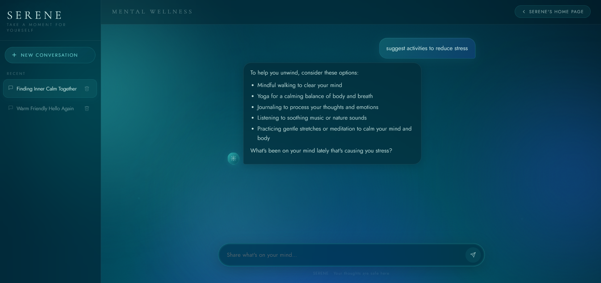 |

### Mindful Journal
| New Entry | Saved Journals | Mood Calendar |
|---|---|---|
| 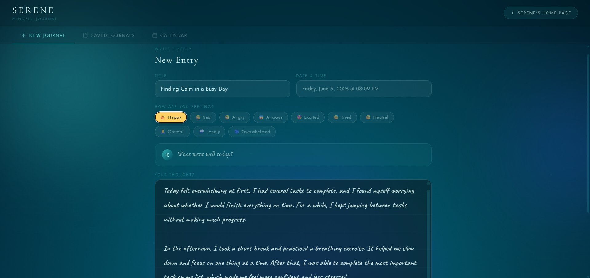 | 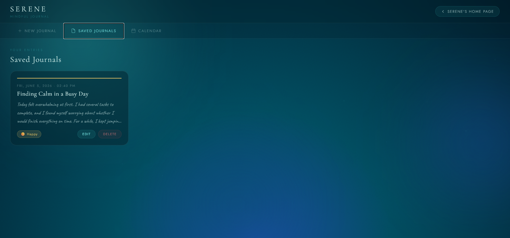 | 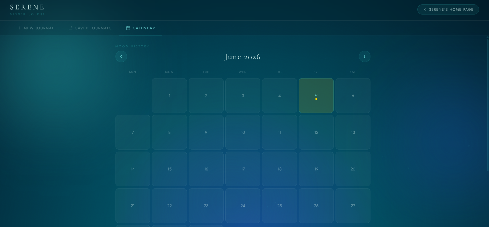 |

### Breathing Sanctuary
| Sanctuary | Session |
|---|---|
| 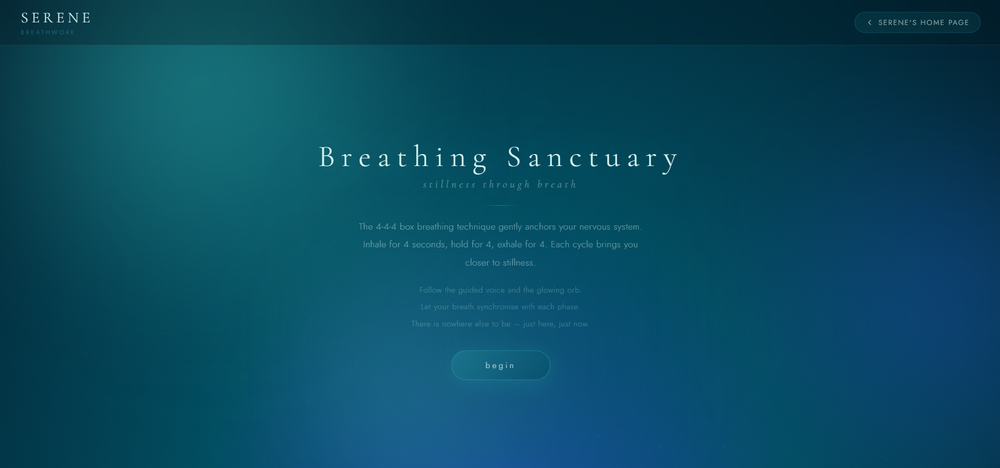 | 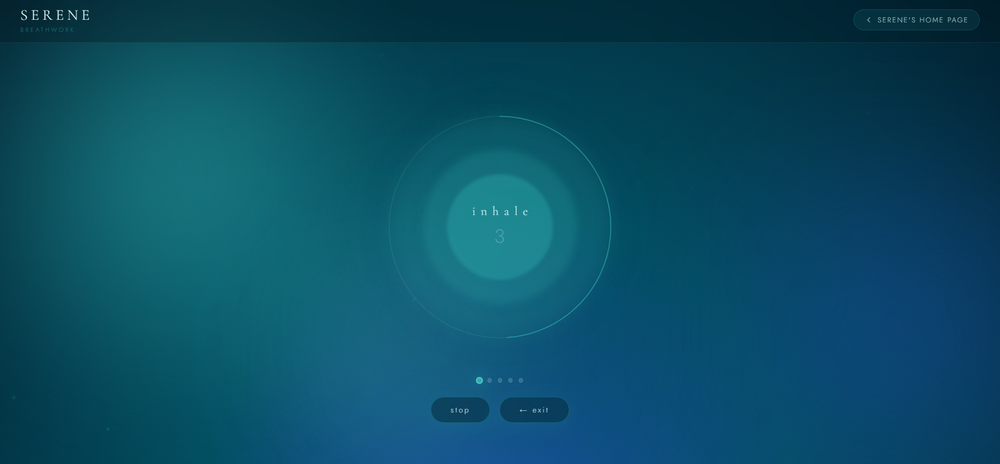 |

### Logout
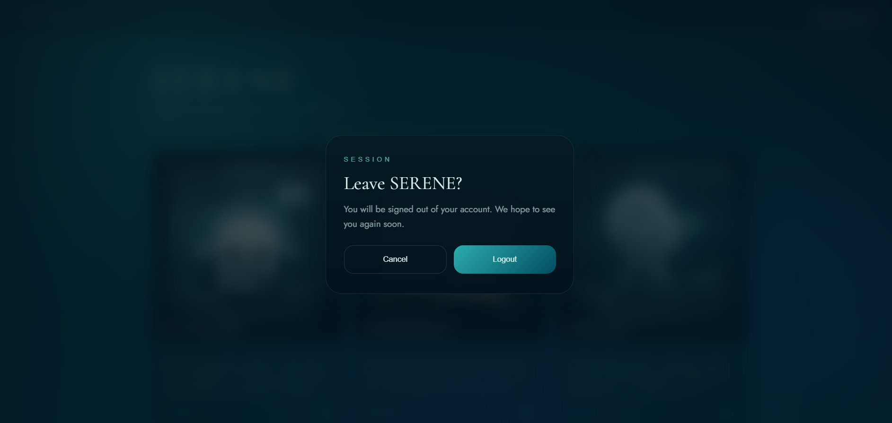

### Admin
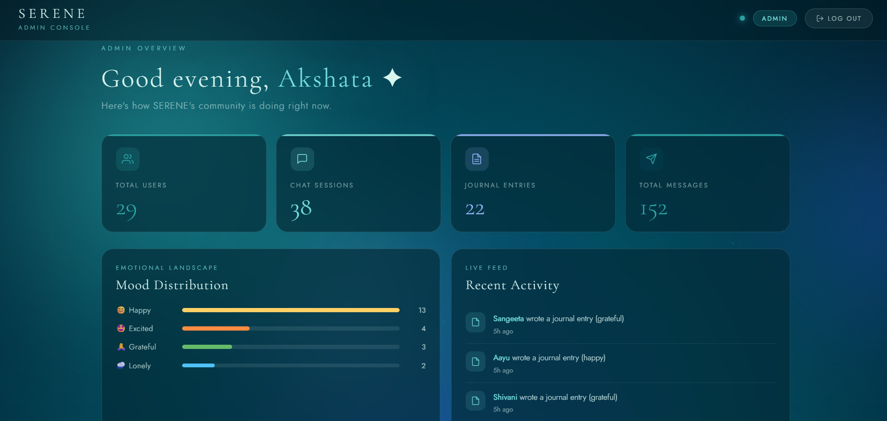

---

## 🛠️ Tech Stack

| Layer | Technology |
|---|---|
| **Frontend** | React.js, Vite, React Router DOM, Axios, CSS |
| **Backend** | FastAPI, Python, Uvicorn |
| **Database** | MongoDB Atlas, Motor (Async Driver) |
| **Auth** | JWT (JSON Web Tokens), Passlib |
| **AI** | Groq API |
| **Deployment** | Vercel (Frontend), Render (Backend), MongoDB Atlas (DB) |

---

## 🏗️ System Architecture

```
User Browser
     │
     ▼
React Frontend  ──────── Vercel
     │
     │  REST API (Axios)
     ▼
FastAPI Backend ──────── Render
     │
     ├──── MongoDB Atlas   (user data, journals, chat history)
     │
     └──── Groq AI API     (mental wellness chatbot responses)
```

---

## 🚀 Getting Started

### Prerequisites
- Node.js v18+
- Python 3.10+
- MongoDB Atlas account
- Groq API key

---

### 1. Clone the Repository

```bash
git clone https://github.com/akshata-gangrade/SERENE.git
cd SERENE
```

---

### 2. Backend Setup

```bash
cd backend
python -m venv venv
venv\Scripts\activate        # Windows
# source venv/bin/activate   # macOS/Linux

pip install -r requirements.txt
```

Create a `.env` file in the `backend/` directory:

```env
MONGO_URI=your_mongodb_connection_string 
DB_NAME=your_database_name 
JWT_SECRET=your_jwt_secret 
JWT_ALGORITHM=HS256 
ACCESS_TOKEN_EXPIRE_MINUTES=time_provided
GROQ_API_KEY=your_groq_api_key 
GROQ_MODEL=your_groq_model
```

Start the backend:

```bash
uvicorn app.main:app --reload
```

---

### 3. Frontend Setup

```bash
cd frontend
npm install
```

Create a `.env` file in the `frontend/` directory:

```env
VITE_API_URL=https://your-deployed-backend-url
```

Start the frontend:

```bash
npm run dev
```

---

## 📂 Project Structure

```
SERENE/
│
├── frontend/
│   └── src/
│       ├── pages/          # Route-level page components
│       ├── components/     # Reusable UI components
│       ├── assets/         # Images, icons
│       └── services/       # Axios API calls
│
├── backend/
│   └── app/
│       ├── routes/         # API route handlers
│       ├── services/       # Business logic
│       ├── models/         # Pydantic schemas
│       ├── database/       # MongoDB connection
│       └── utils/          # Helpers (auth, hashing)
│
├── screenshots/            # UI screenshots for README
│
└── README.md
```

---

## 🎯 Future Enhancements

- [ ] Mood Tracking Analytics with visual graphs
- [ ] AI-Generated Wellness Insights from journal entries
- [ ] Password Reset & Email Verification
- [ ] Personalized Wellness Recommendations
- [ ] Dark / Light Theme Toggle
- [ ] Mobile App (React Native)

---

## ⚠️ Note on Backend Hosting

The backend is deployed on Render's free tier. The first request after a period of inactivity may take **10–30 seconds** while the server wakes up. Subsequent requests will be fast.

---

## 👩‍💻 Author

**Akshata Gangrade**
B.Tech Computer Science & Engineering

[](https://github.com/akshata-gangrade)

---

## 🙏 Acknowledgements

- [Groq AI](https://groq.com/) — ultra-fast inference for the wellness chatbot
- [FastAPI](https://fastapi.tiangolo.com/) — modern, high-performance Python web framework
- [React](https://react.dev/) — UI library
- [MongoDB Atlas](https://www.mongodb.com/atlas) — cloud database
- [Render](https://render.com/) & [Vercel](https://vercel.com/) — deployment platforms

---

<div align="center">

*SERENE was built as a safe digital space where users can pause, reflect, and find support through technology.*
*By combining AI, journaling, and mindfulness, SERENE makes mental wellness tools more accessible for everyone.* 💙

</div>